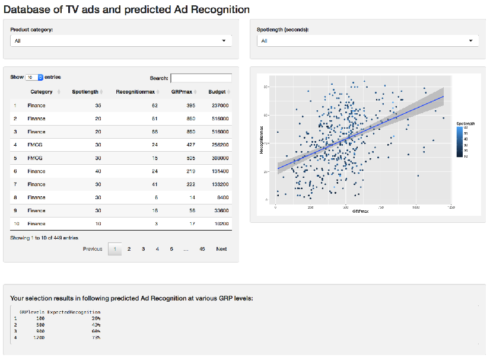

<style>
.title-slide {
  background-color: #FFFFFF; /* #EDE0CF; ; #CA9F9D*/
}
</style>

## Adcognise: app for predicting ad recognition

<br>
<br>
<br>
#### For a tv advertising campaign to have any effect, it must at the very least be recognised. TV advertising recognition typically ranges between 20% and 80%. It is important to optimize the chances of high ad recogntion when planning a tv advertising campaign.
<br>
#### Adcognise is an app that enables media planners to estimate the potential Ad Recognition of a tv ad as a function of spot length and product category. It gives an idea of how many GRP* a tv ad will need in order to reach a certain Ad Recognition.
<br>
GRP = Gross Rating Points, the standard measure indicating how many people have been exposed to the ad, how many times.


--- .class #id 

## Adcognise: a robust estimate

Adcognise is a tool based on a database containing the Ad Recogntion scores of hundreds of effectiveness studies for a variety of advertisers in 4 main product categories for a variety of spot lengths:



--- .class #id 

## HOW to USE Adcognise:

<br>
<ol>Select the product category you're interested in</ol>
<ol>Select the length in seconds of the commercial you want to predict for</ol>
<ol>check the scatterplot to make sure you're basing your estimate on a sufficiently large set of observations</ol>
<ol>And see what the estimated Ad Recognition would be at 100, 500, 900 and 1200 GRP.</ol>


--- .class #id

## Have a look at Adcognise:
[Show me the App!](https://jikkeromijn.shinyapps.io/Adrecognition/)

We'll also download the whole underlying dataset for you from Github directly for further analyses. Make sure to check your current working directory for the dataset and delete it if you don't want it:

```r
fileUrl <- "https://raw.githubusercontent.com/Jikkeromijn/Coursera-Course-Project-Developing-Data-Products/master/recognition.txt"
download.file(fileUrl, destfile="./Adcognisedata.txt")
```

I hope you'll enjoy using Adcognise!


--- .class #id 
